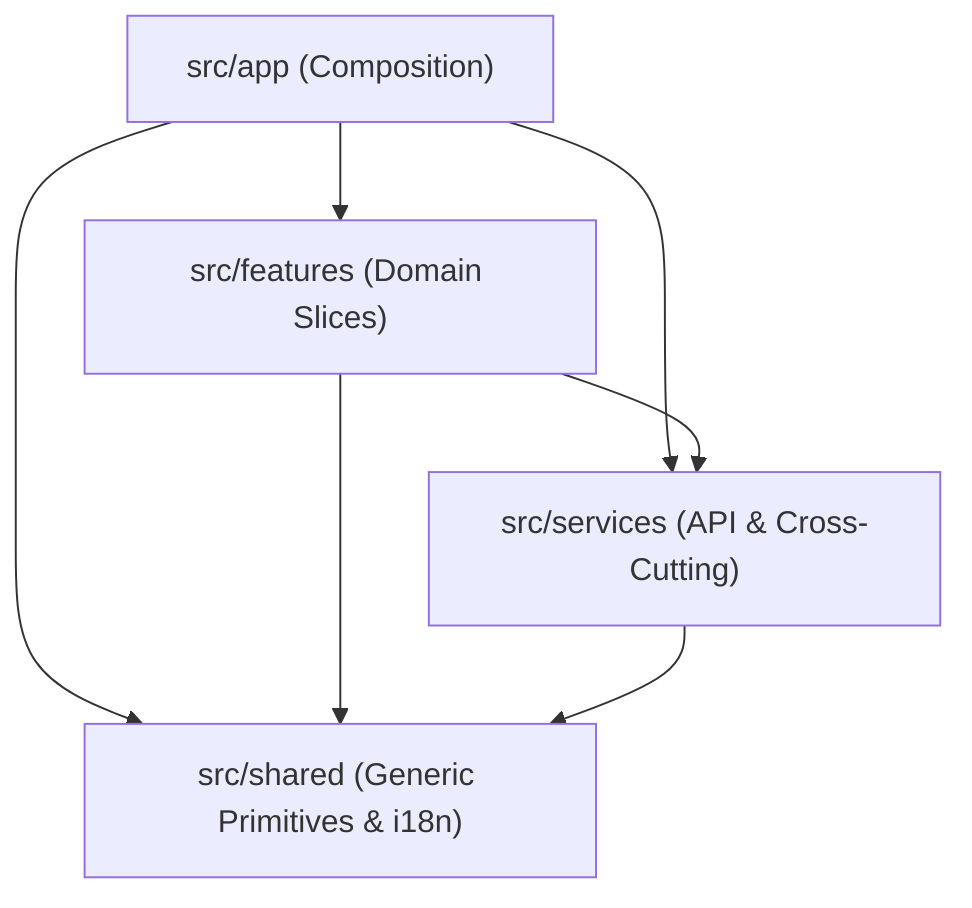
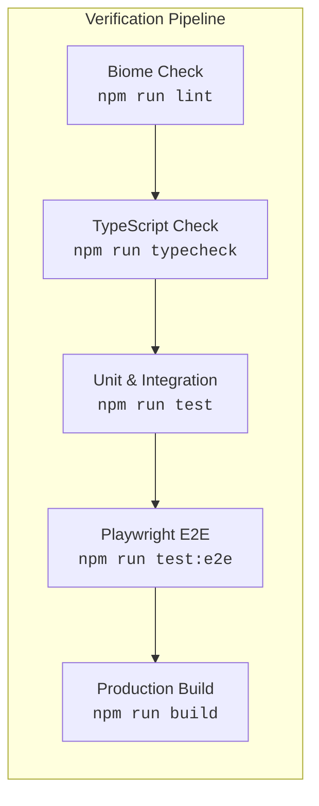

# Basketball Training Sessions Workspace

A modern, responsive React Single Page Application (SPA) designed as an operational dashboard for basketball academy operators and coaches. The workspace provides dense, real-time schedule scanning, status filtering, and constraint-validated session scheduling, replacing fragmented spreadsheets, calendars, and manual chat messages.

Built using the **Evolutionary Design (ED) "Small"** architecture, the project features a client-side architecture with Mock Service Worker (MSW 2) for zero-backend local development, TanStack Query for server-state management, bilingual internationalization (`en` and `ru`), and comprehensive test coverage across unit, integration, and browser end-to-end suites.

---

## Table of Contents

- [Overview](#overview)
- [Key Features](#key-features)
- [Architecture & Directory Structure](#architecture--directory-structure)
  - [Architectural Layers](#architectural-layers)
  - [Dependency Flow](#dependency-flow)
  - [Project Directory Layout](#project-directory-layout)
- [Technology Stack](#technology-stack)
- [Prerequisites](#prerequisites)
- [Quick Start](#quick-start)
- [Environment Configuration](#environment-configuration)
- [Development Workflow & Scripts](#development-workflow--scripts)
- [Testing & Quality Assurance](#testing--quality-assurance)
  - [Unit & Integration Testing (Vitest)](#unit--integration-testing-vitest)
  - [End-to-End Testing (Playwright)](#end-to-end-testing-playwright)
  - [Static Analysis & Formatting (Biome)](#static-analysis--formatting-biome)
  - [Type Checking (TypeScript)](#type-checking-typescript)
- [Usage & Interactive Mock Scenarios](#usage--interactive-mock-scenarios)
  - [Application Routes](#application-routes)
  - [Status Filtering & URL State](#status-filtering--url-state)
  - [Fault Injection & Scenario Simulator](#fault-injection--scenario-simulator)
  - [API Contract Summary](#api-contract-summary)
- [Internationalization (i18n)](#internationalization-i18n)
- [Production Build & Deployment](#production-build--deployment)
- [Troubleshooting](#troubleshooting)
- [Contribution Guidelines](#contribution-guidelines)
- [Security & Privacy](#security--privacy)
- [License & Repository Status](#license--repository-status)

---

## Overview

Basketball academy operators manage complex schedules involving multiple coaches, court locations, age brackets, and capacity limits. This workspace addresses operational friction by providing:

1. **Dense Schedule Scanning**: Quickly assess training sessions, capacity, court allocations, and current statuses without decorative overhead.
2. **Context Retention**: Filter schedules by status and inspect details while preserving active view state, scroll position, and URL parameters.
3. **Constraint-Validated Scheduling**: Inline validation for training session creation (trimmed title length, strict future date verification) preventing accidental double-bookings or invalid entries.
4. **Complete Offline / Zero-Backend Capability**: Full functional fidelity in local development and testing via a Mock Service Worker (MSW) boundary implementing the production API contract.

For detailed domain requirements and business logic, see:
- [`ai/context/product.md`](ai/context/product.md) — Product vision, user personas, and core flows.
- [`ai/context/business-rules.md`](ai/context/business-rules.md) — Domain constraints, validation rules, and time handling.
- [`ai/context/glossary.md`](ai/context/glossary.md) — Standardized domain terminology and entity mappings.

---

## Key Features

- **Training Sessions Workspace (`/sessions`)**:
  - Live session list showing title, session type, translated status, capacity, coach, location, and localized start timestamp.
  - Formatted time display in the user's local timezone using browser `Intl.DateTimeFormat` APIs.
- **Bi-directional Status Filtering**:
  - Filter list by `All` or `Scheduled` sessions.
  - Active filter state synchronizes with the URL search parameters (`?status=scheduled`), enabling bookmarking and deep linking while preserving unrelated query params.
- **Interactive Session Creation**:
  - Modal/inline form to schedule new training sessions.
  - Form validation for trimmed titles (3–80 characters) and strictly future start date/time (evaluated against a live clock on submission).
  - Duplicate-submission prevention with pending request state handling.
  - Dynamic error clearing as input fields become valid.
- **Resilient Query States**:
  - Explicit loading indicators with accessible `role="status"` regions.
  - Recoverable error banners (`role="alert"`) with manual retry actions.
  - Dedicated empty state copy when no sessions match filter criteria.
- **Bilingual Internationalization (i18n)**:
  - English (`en`) and Russian (`ru`) translations.
  - Zero hardcoded UI strings; key parity guarded by automated tests.
- **Mock Service Worker (MSW 2) Simulation**:
  - Client-side mock boundary running in the browser during development.
  - URL query flag (`?mock=<scenario>`) for instant fault injection and edge-case testing (e.g., slow networks, server errors, empty states).

---

## Architecture & Directory Structure

The project follows the **Evolutionary Design (ED) "Small"** React architectural blueprint specified in [`ARCHITECTURE.md`](ARCHITECTURE.md). It organizes code into four unidirectional layers, keeping business modules decoupled and preventing cyclic dependencies.

### Architectural Layers

1. **`src/app/` (Composition Layer)**:
   - Root application setup, router definition (`createBrowserRouter`), global providers (TanStack Query, i18next), root layouts, and top-level smoke tests.
   - Manages application-wide composition; contains no domain business logic.
2. **`src/features/` (Functional Layer)**:
   - Independent product slices organized into `ui/`, `model/`, and an `index.ts` public API barrel.
   - Example: `src/features/sessions/` manages the training sessions workspace UI and TanStack Query hooks.
3. **`src/services/` (Business Services Layer)**:
   - Reusable, cross-feature business modules and external I/O boundaries.
   - Contains the HTTP client (`src/services/api/http.ts`) and typed endpoint wrappers (`src/services/api/endpoints/sessions.ts`).
4. **`src/shared/` (Generic Layer)**:
   - Stateless, domain-agnostic building blocks, utilities (`src/shared/lib/cn.ts`), and i18n configurations/locales (`src/shared/i18n/`).

> [!IMPORTANT]
> **Infrastructure Directories**: `src/mocks/` (MSW handlers, seed data, in-memory store) and `src/test/` (Vitest setup, custom renderers) are infrastructure concerns that sit outside the four architectural layers. Application code must never import from `mocks/` or `test/`.

### Dependency Flow

Dependencies flow strictly downward. Bypassing layers or importing upwards is prohibited:



- **Feature Barrel Rule**: Features export their interface strictly through `src/features/<feature>/index.ts`. External consumers (such as `src/app/router.tsx`) must never deep-import feature internals.

### Project Directory Layout

```text
frontend-accelerator-work/
├── ai/                         # Persistent AI memory (product, business rules, glossary)
├── e2e/                        # Playwright end-to-end browser tests
│   └── sessions.spec.ts        # E2E test verifying list, filter, and session creation
├── public/                     # Static assets
│   ├── favicon.svg             # Application favicon
│   └── mockServiceWorker.js    # MSW 2 browser service worker script
├── src/
│   ├── app/                    # Composition layer: router, providers, layout
│   │   ├── App.tsx             # Root application component
│   │   ├── App.smoke.test.tsx  # Smoke test mounting full application
│   │   ├── AppLayout.tsx       # Main visual shell with header and container
│   │   ├── providers.tsx       # TanStack Query & i18next provider wrappers
│   │   └── router.tsx          # React Router 7 route definitions
│   ├── features/               # Functional feature slices
│   │   └── sessions/           # Training sessions workspace
│   │       ├── index.ts        # Public barrel export
│   │       ├── model/          # Query hooks, mutations, date/time logic, tests
│   │       └── ui/             # Page, list, filter, and form components, tests
│   ├── services/               # Shared business services
│   │   └── api/                # HTTP fetch client & typed endpoint wrappers
│   │       ├── endpoints/      # Session API wrappers and TypeScript contract types
│   │       └── http.ts         # Fetch wrapper with typed HttpError
│   ├── shared/                 # Generic reusable primitives & utilities
│   │   ├── i18n/               # i18next initialization and en/ru JSON locale files
│   │   ├── lib/                # Generic utility helpers (cn.ts)
│   │   └── ui/                 # Shared UI primitives (reserved for shadcn/ui)
│   ├── mocks/                  # MSW infrastructure (dev worker, handlers, test server)
│   │   ├── browser.ts          # Browser worker startup logic
│   │   ├── handlers.ts         # MSW request handlers for /api/sessions
│   │   ├── scenario.ts         # Fault injection and ?mock= scenario switcher
│   │   ├── server.ts           # Node server for Vitest integration tests
│   │   ├── data/               # Deterministic seed fixtures
│   │   └── db/                 # In-memory mock database store
│   ├── test/                   # Vitest infrastructure and test render utilities
│   │   ├── msw.ts              # Per-test MSW handler override helper
│   │   ├── render-app.tsx      # Test render utility with Query & i18n providers
│   │   └── setup.ts            # Vitest lifecycle hooks & MSW node server startup
│   ├── index.css               # Global stylesheet with Tailwind CSS 4 entry
│   └── main.tsx                # Client entry point (starts MSW in dev, renders App)
├── tasks/                      # Work logs, specs, and implementation records
├── training/                   # Onboarding briefs, assessment specs, and API contracts
├── biome.jsonc                 # Biome 2 linter and formatter configuration
├── index.html                  # HTML entry template
├── package.json                # Project dependencies, scripts, and MSW config
├── playwright.config.ts        # Playwright test runner configuration
├── tsconfig.app.json           # Application TypeScript configuration (with @/* alias)
├── tsconfig.json               # Root TypeScript project reference configuration
└── vite.config.ts              # Vite 7 build configuration and Vitest settings
```

---

## Technology Stack

| Layer / Concern | Technology | Version | Description |
| :--- | :--- | :--- | :--- |
| **UI Framework** | [React](https://react.dev/) | `^19.2.8` | Component model using React 19 features |
| **Routing** | [React Router](https://reactrouter.com/) | `^7.18.3` | Library mode routing via `createBrowserRouter` |
| **Server State** | [TanStack Query](https://tanstack.com/query/latest) | `^5.102.8` | Declarative data fetching, caching, and invalidation |
| **Language** | [TypeScript](https://www.typescriptlang.org/) | `~5.9` | Strict type checking with `noUncheckedIndexedAccess` |
| **Build & Dev Tool** | [Vite](https://vite.dev/) | `^7.3.6` | Fast ESM development server and Rollup production bundler |
| **Styling** | [Tailwind CSS](https://tailwindcss.com/) | `^4.3.3` | Utility-first styling with `@tailwindcss/vite` plugin |
| **Class Utilities** | `clsx` & `tailwind-merge` | `^2.1.1` / `^3.6.0` | Conflict-free className merging via `cn()` helper |
| **Internationalization**| [i18next](https://www.i18next.com/) & `react-i18next` | `^26.4.1` / `^17.0.13` | English and Russian localized translation bundles |
| **API Mocking** | [MSW (Mock Service Worker)](https://mswjs.io/) | `^2.15.0` | Intercepts `/api` requests in dev (worker) and test (node) |
| **Unit / Component Test**| [Vitest](https://vitest.dev/) | `^4.1.11` | Vite-native test runner with jsdom environment |
| **DOM Testing** | [Testing Library](https://testing-library.com/) | `^16.3.3` | Behavior-driven React component testing |
| **End-to-End Test** | [Playwright](https://playwright.dev/) | `^1.62.1` | Full browser integration testing against real UI flows |
| **Linter & Formatter** | [Biome](https://biomejs.dev/) | `^2.5.11` | Fast, unified linter and formatter (`biome.jsonc`) |
| **Package Manager** | `npm` | `>=10.0.0` | Pinned package manager (pnpm and yarn are prohibited) |

---

## Prerequisites

Before setting up the project, ensure you have the following installed on your machine:

- **Node.js**: `v20.x`, `v22.x`, or `v24.x` (LTS recommended; tested and verified on Node `v24.18.0`).
- **npm**: `v10.x` or `v11.x` (bundled with Node.js; tested on `11.16.0`).
  > [!CAUTION]
  > **npm Only**: Do not use `pnpm` or `yarn`. Dependency resolution, `package-lock.json`, and accelerator toolchain rules are strictly configured for standard `npm`.
- **Browser**: Any modern evergreen browser (Chrome, Chromium, Edge, Firefox, Safari) with Service Worker support enabled for local development.

---

## Quick Start

Execute the following commands from the repository root directory:

1. **Clone the repository**:
   ```bash
   git clone <repository-url>
   cd frontend-accelerator-work
   ```

2. **Install dependencies**:
   ```bash
   npm install
   ```

3. **Start the local development server**:
   ```bash
   npm run dev
   ```

4. **Access the application**:
   Open [http://localhost:5173](http://localhost:5173) in your browser. The root path (`/`) will automatically redirect to the training sessions workspace at [`/sessions`](http://localhost:5173/sessions).

During development, MSW will automatically register `public/mockServiceWorker.js` and log intercepted `/api/sessions` requests in your browser's developer tools console:
```text
[MSW] Mocking enabled.
```

---

## Environment Configuration

Because this application is an offline-capable, client-side SPA backed by Mock Service Worker, **no `.env` file or external API tokens are required** to develop, run, or test the project locally.

The runtime utilizes standard environment flags provided by Vite and test runners:

| Variable | Target Scope | Type | Default | Description |
| :--- | :--- | :--- | :--- | :--- |
| `import.meta.env.DEV` | Application (`src/main.tsx`) | `boolean` | `true` in `npm run dev` | Injected by Vite. Automatically bootstraps the MSW browser service worker in development mode. Excluded from production builds. |
| `process.env.CI` | Testing (`playwright.config.ts`) | `string` / `boolean` | `undefined` | Optional CI flag. When set, Playwright runs with 1 worker, 2 retries, and forbids `.only` test blocks. |

### Safe Local Setup

- Do not commit `.env` or credential files to version control.
- In the current architecture, no private backend credentials, secrets, or API tokens exist on the frontend.
- When connecting to a live backend in production, configure any target endpoints via reverse-proxy rules rather than embedding hardcoded secrets into client-side bundles.

---

## Development Workflow & Scripts

All project tasks are operated through standard npm scripts defined in [`package.json`](package.json). Run all commands from the repository root:

```bash
# Start the Vite development server with MSW mocking enabled
npm run dev

# Alternative alias to start the development server
npm start

# Compile TypeScript and build the production bundle into dist/
npm run build

# Preview the local production build generated in dist/
npm preview

# Run Biome static analysis and lint checks across the codebase
npm run lint

# Automatically fix linting warnings and format errors using Biome
npm run lint:fix

# Format all supported files (TS, TSX, JSON, Markdown) using Biome
npm run format

# Run TypeScript compiler check without emitting output files
npm run typecheck

# Run Vitest unit and integration test suite once
npm run test

# Run Vitest in interactive watch mode for active TDD development
npm run test:watch

# Run Playwright end-to-end tests in headless Chromium
npm run test:e2e
```

---

## Testing & Quality Assurance

The codebase employs a multi-tiered testing strategy ensuring code correctness, accessibility, and resilient behavior under error conditions.



### Unit & Integration Testing (Vitest)

Unit and behavior-level component integration tests are colocated alongside source files (`src/**/*.{test,spec}.{ts,tsx}`).

- **Test Infrastructure**: Uses Vitest 4 with `jsdom` and `@testing-library/react`.
- **Mock Boundary**: The MSW Node server (`src/mocks/server.ts`) intercepts all outgoing network requests. `src/test/setup.ts` enforces `onUnhandledRequest: "error"` so that unmocked network calls immediately fail tests.
- **Isolation**: In-memory database state is reset before each test via `resetSessionsDb()`.
- **Colocated Coverage**:
  - `src/features/sessions/model/create-session.test.ts` — Title and date validation tests.
  - `src/features/sessions/model/date-time.test.ts` — Wall-clock parsing and UTC conversion tests.
  - `src/features/sessions/model/sessions-query.test.tsx` — TanStack Query cache key and fetching tests.
  - `src/features/sessions/model/use-create-session-mutation.test.tsx` — Mutation and cache invalidation tests.
  - `src/features/sessions/ui/SessionsWorkspacePage.list.test.tsx` — Loading, error, populated states.
  - `src/features/sessions/ui/SessionsWorkspacePage.filter.test.tsx` — Status filtering and URL synchronization.
  - `src/features/sessions/ui/SessionsWorkspacePage.create.test.tsx` — Form validation, submission, and list refresh.
  - `src/app/App.smoke.test.tsx` — Root application mounting and route redirection.
  - `src/shared/i18n/sessions-namespace.test.ts` — Translation key parity between `en` and `ru`.

Run tests:
```bash
npm run test
```

### End-to-End Testing (Playwright)

End-to-end tests located in `e2e/` run real user workflows in headless Chromium against the live Vite server:

- Opens root `/` and verifies redirection to `/sessions`.
- Verifies initial rendering of seed sessions.
- Exercises the status dropdown filter (`Scheduled` vs `All`).
- Opens the session creation form, submits a valid future-dated session, and verifies that the new session appears in the list.

Run E2E tests:
```bash
npm run test:e2e
```

### Static Analysis & Formatting (Biome)

Biome 2 is the single source of truth for formatting and linting:
- **Code Style**: Indent with tabs (width 4) for JS/TS/TSX; spaces (width 2) for JSON, CSS, and Markdown. Double quotes for JS/TS.
- **Rules**: Recommended Biome linting rules enabled.
- **Exclusions**: Tooling and build folders (`dist/`, `public/`, `toolchain/`, `.agents/`, `.claude/`) are excluded.

Check and format:
```bash
npm run lint
npm run format
```

### Type Checking (TypeScript)

TypeScript 5.9 is configured with strict type checks across project references (`tsconfig.json`, `tsconfig.app.json`, and `tsconfig.node.json`):
- `strict: true`
- `noUncheckedIndexedAccess: true`
- `noEmit: true`

Run typecheck:
```bash
npm run typecheck
```

---

## Usage & Interactive Mock Scenarios

### Application Routes

- `/` — Index route. Automatically redirects to `/sessions` via a React Router loader.
- `/sessions` — Training Sessions Workspace. Contains the status filter, session creation form toggle, and session list.

### Status Filtering & URL State

The status filter updates the browser URL with replace semantics, preserving any query flags already present:
- `http://localhost:5173/sessions` — Displays all sessions.
- `http://localhost:5173/sessions?status=scheduled` — Filters view to show only scheduled sessions.

### Fault Injection & Scenario Simulator

The mock boundary includes an interactive scenario switch read directly from the page URL (`?mock=<scenario>`). This enables instant manual QA of loading, empty, and failure states:

| Scenario Flag | URL Example | Observed Behavior |
| :--- | :--- | :--- |
| `normal` *(default)* | `http://localhost:5173/sessions?mock=normal` | Standard behavior with five seeded training sessions (`ses_101`–`ses_105`). |
| `empty` | `http://localhost:5173/sessions?mock=empty` | Simulates an empty database. Renders the translated empty state message. |
| `slow` | `http://localhost:5173/sessions?mock=slow` | Introduces an artificial 1500 ms network delay. Displays the loading state (`Loading sessions…`). |
| `list-error` | `http://localhost:5173/sessions?mock=list-error` | Intercepts `GET /api/sessions` with HTTP `500`. Renders the error banner with a "Try again" action. |
| `list-error-once` | `http://localhost:5173/sessions?mock=list-error-once` | Fails the initial list load (within a 500 ms window to tolerate React StrictMode remounts). Clicking "Try again" subsequently succeeds. |
| `create-error` | `http://localhost:5173/sessions?mock=create-error` | Intercepts `POST /api/sessions` with HTTP `500`. The creation form remains open and editable without resetting input fields. |

You can combine filter parameters and mock scenarios freely:
```text
http://localhost:5173/sessions?status=scheduled&mock=slow
```

### API Contract Summary

The application interacts with two mock endpoints conforming to [`training/frontend-accelerator-assessment/API_CONTRACT.md`](training/frontend-accelerator-assessment/API_CONTRACT.md):

#### 1. List Sessions: `GET /api/sessions`

- **Query Parameters**:
  - `status` *(optional)*: `"scheduled" | "full" | "cancelled" | "completed"`
- **Response `200 OK`**:
  ```json
  {
    "data": [
      {
        "id": "ses_101",
        "title": "U14 Shooting Lab",
        "type": "training",
        "status": "scheduled",
        "startsAt": "2027-08-03T16:00:00Z",
        "durationMinutes": 90,
        "capacity": 18,
        "bookedCount": 14,
        "visibility": "public",
        "coach": {
          "id": "coach_01",
          "name": "Maya Brooks",
          "email": "maya@example.test"
        },
        "location": {
          "name": "North Court",
          "address": "18 Harbor Street"
        },
        "updatedAt": "2027-07-26T09:15:00Z"
      }
    ],
    "meta": {
      "page": 1,
      "pageSize": 10,
      "total": 1
    }
  }
  ```

#### 2. Create Session: `POST /api/sessions`

- **Request Body**:
  ```json
  {
    "title": "Elite Dribbling Clinic",
    "startsAt": "2028-10-15T12:30:00Z",
    "type": "training",
    "durationMinutes": 90,
    "coachId": "coach_01",
    "locationName": "North Court",
    "locationAddress": "18 Harbor Street",
    "capacity": 18,
    "visibility": "public"
  }
  ```
- **Response `201 Created`**: Returns a `SessionDetails` object (summary plus `description`, `trainerNotes`, `createdAt`, and `cancellation`).

---

## Internationalization (i18n)

Internationalization is powered by `i18next` and `react-i18next`.

- **Supported Locales**: English (`en`, default) and Russian (`ru`).
- **Namespaces**:
  - `common`: Generic application copy, headings, and shared action labels (`src/shared/i18n/locales/{en,ru}/common.json`).
  - `sessions`: Feature-specific copy, validation errors, and status labels (`src/shared/i18n/locales/{en,ru}/sessions.json`).
- **Strict Parity Rule**: Any new UI copy must be added to **both** `en` and `ru` JSON files. Automated parity is verified during test runs by `src/shared/i18n/sessions-namespace.test.ts`.

---

## Production Build & Deployment

### Generating Production Assets

Run the build script:
```bash
npm run build
```
This runs TypeScript compilation (`tsc -b`) followed by Vite's production bundling. The output is placed in the `dist/` directory:

```text
dist/
├── index.html                   # HTML entry point
└── assets/
    ├── index-<hash>.css         # Optimized Tailwind CSS bundle
    └── index-<hash>.js          # Minified JavaScript bundle
```

### Previewing the Production Build

To test the compiled assets locally before deployment:
```bash
npm run preview
```
This serves the contents of `dist/` at [http://localhost:4173](http://localhost:4173).

### Deployment Considerations

1. **Static Hosting**: The contents of `dist/` can be deployed directly to any static web hosting provider (e.g., Cloudflare Pages, Vercel, Netlify, AWS S3 + CloudFront, or Nginx).
2. **SPA Fallback Routing**: Because React Router uses HTML5 History mode (`createBrowserRouter`), the hosting provider or web server must be configured to route all non-file requests back to `/index.html` (rewrite rule: `/*` -> `/index.html`).
3. **API Routing in Production**:
   - The MSW service worker is conditionally loaded only when `import.meta.env.DEV` is true. In production builds, MSW is not initialized.
   - For a production deployment, `/api` requests must be proxied to a live backend service conforming to the [API Contract](training/frontend-accelerator-assessment/API_CONTRACT.md).

---

## Troubleshooting

### 1. MSW Service Worker Not Intercepting Requests
- **Symptom**: Browser network tab shows failed `404` or unhandled network requests to `/api/sessions`.
- **Cause**: The mock service worker script `public/mockServiceWorker.js` failed to register, or browser private/incognito mode blocked service workers.
- **Resolution**: Verify that `public/mockServiceWorker.js` exists in the repository. Open the browser console and check for `[MSW] Mocking enabled.` If absent, unregister any stale service workers in DevTools (*Application > Service Workers*) and reload the page.

### 2. Form Submission Rejects Future Start Time
- **Symptom**: Entering a date/time yields validation error `"The start date and time must be in the future."`
- **Cause**: The application requires the start date/time to be strictly in the future (at least the next full minute after the current minute floor). A time selected within the current minute is rejected by design to prevent race conditions during form completion.
- **Resolution**: Choose a timestamp at least two minutes into the future or a future calendar day.

### 3. `list-error-once` Fails Multiple Times in React Dev Mode
- **Symptom**: Refreshing the page with `?mock=list-error-once` fails, and clicking "Try again" immediately fails again.
- **Cause**: React 19 `StrictMode` intentionally unmounts and remounts components in development. To prevent the remount from consuming the single failure latch before the user sees the error, the mock boundary enforces a 500 ms attempt window.
- **Resolution**: Wait at least 500 ms after the initial error renders before clicking "Try again" to allow the attempt window to elapse.

### 4. Package Installation Errors with Yarn or pnpm
- **Symptom**: Lockfile conflicts or missing peer dependency warnings.
- **Cause**: The repository uses npm-specific lockfiles (`package-lock.json`) and configuration.
- **Resolution**: Remove any generated `yarn.lock` or `pnpm-lock.yaml`, run `npm install`, and only use `npm run <script>`.

---

## Contribution Guidelines

Contributions must preserve the architectural boundaries and quality gates of the repository.

### Pre-Submission Validation Checklist

Before opening a pull request or submitting changes, ensure that all quality gates pass without errors or warnings:

```bash
# 1. Lint check with Biome
npm run lint

# 2. TypeScript compilation check
npm run typecheck

# 3. Unit and integration tests with Vitest
npm run test

# 4. End-to-end browser tests with Playwright
npm run test:e2e

# 5. Production build verification
npm run build
```

### Architectural Rules & Coding Standards

1. **Adhere to Layer Boundaries**:
   - `app` may import `features`, `services`, and `shared`.
   - `features` may import `services` and `shared`, but **never** `app`.
   - `services` may import `shared`, but **never** `app` or `features`.
   - `shared` must not import from any other layer.
   - Application layers must never import from `src/mocks/` or `src/test/`.
2. **Public API Exports**:
   - Expose feature capabilities exclusively through `src/features/<feature>/index.ts`.
   - Never deep-import from internal paths of other features.
3. **No Hardcoded UI Strings**:
   - Every user-facing string must be internationalized through `useTranslation`.
   - Add new translation keys to both `src/shared/i18n/locales/en/` and `src/shared/i18n/locales/ru/`.
4. **Colocate Tests**:
   - Keep behavior and unit tests next to the code they verify (`*.test.ts`, `*.test.tsx`).
5. **Formatting and Style**:
   - Adhere to formatting rules defined in `biome.jsonc` (run `npm run format`).

---

## Security & Privacy

- **No Stored Secrets**: The application is a client-side single-page application. No secret keys, API tokens, database credentials, or private certificates are stored in or required by this repository.
- **Mock Data Safety**: All mock coaches (`Maya Brooks`, `Ethan Cole`, `Lena Ortiz`) and participant counts use synthetic data and fictional `@example.test` email addresses.
- **Input Sanitization**: Form inputs are trimmed and validated before request construction. The manual fetch client strictly sets request content types and serializes JSON safely.

---

## License & Repository Status

This repository is marked as **private** (`"private": true` in [`package.json`](package.json)). All rights are reserved. Unauthorized copying, distribution, or modification of these files is strictly prohibited.

For architectural references, onboarding briefs, and training specifications, consult:
- [`ARCHITECTURE.md`](ARCHITECTURE.md) — Canonical architectural blueprint.
- [`AGENTS.md`](AGENTS.md) — Accelerator agent instructions and tooling policies.
- [`ai/context/`](ai/context/) — Living project memory repository.
- [`training/`](training/) — Training onboarding briefs and evaluation rubrics.
